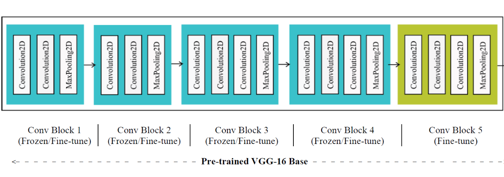

# CXR_C19_DS
### Chest X-Ray Covid-19 Detection System 


#### Pre-trained vgg-16 model architecture:


## Description
Covid-19 detection system using chest x-ray images based on transfer learning. We used [VGG-16](https://keras.io/api/applications/vgg/#vgg16-function) pre-trained model
and fine-tuning to adapt model on our issue.

| Model name      | Accuracy  |  Epochs  |
| :---------      | :-------  |  :-----  |
| VGG-16          | %92       |  30      |


## Authors
* Milad Sadeghi DM [@EverLookNeverSee](https://github.com/EverLookNeverSee)

## Demo
Run command below to display arguments:
```shell
$ python3 demo.py --help

-m    --model          Path to saved model directory
-i    --image          Path to image file
-v    --verbose        Level of verbosity
```

Example:
```shell
$ python3 demo.py --verbose --model <path_to_saved_model_directory> --image <path_to_image_file>
```

## Training on your own dataset
Run command below to display arguments
```shell
$ python3 train.py --help

-d    --dataset             Path to dataset directory
-b    --batch-size          Batch size
-l    --learning-rate       Learning rate
-v    --verbose             Level of verbosity
-w    --workers             Number of workers(Hardware)
-e    --epochs              Number of epochs
-s    --save                Specify a directory path to save trained model
```

Example:
```shell
$ python3 train.py -d ~/dataset -b 32 -l 0.00001 -v -w 32 -e 100 -s ~/models/
```

## Useful links
* Dataset: [COVID-19 Radiography Database](https://www.kaggle.com/tawsifurrahman/covid19-radiography-database)
* Trained VGG-16 model: [Download from google drive](https://drive.google.com/file/d/1PKdD3YDQVDrEgfDlvRhLW7Y4Qus3FTNn/view?usp=sharing)

## License
This project licensed under the **MIT License** - see the [LICENSE](LICENSE) file for more details.
